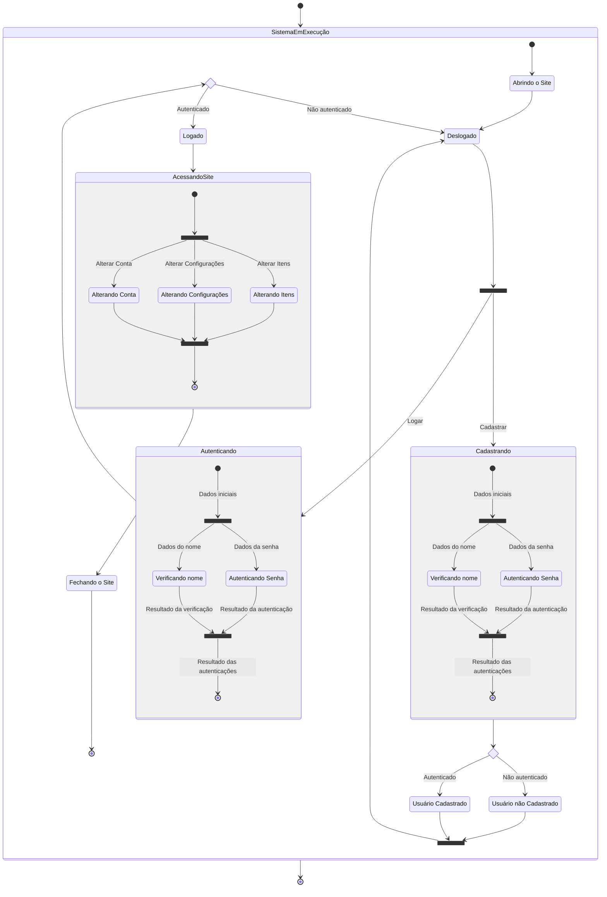
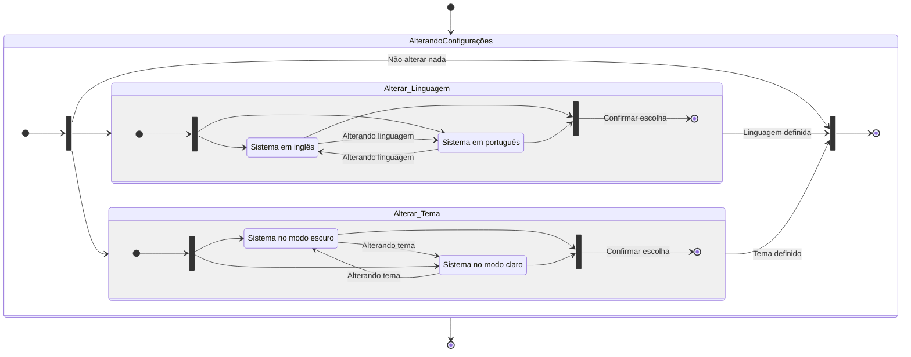
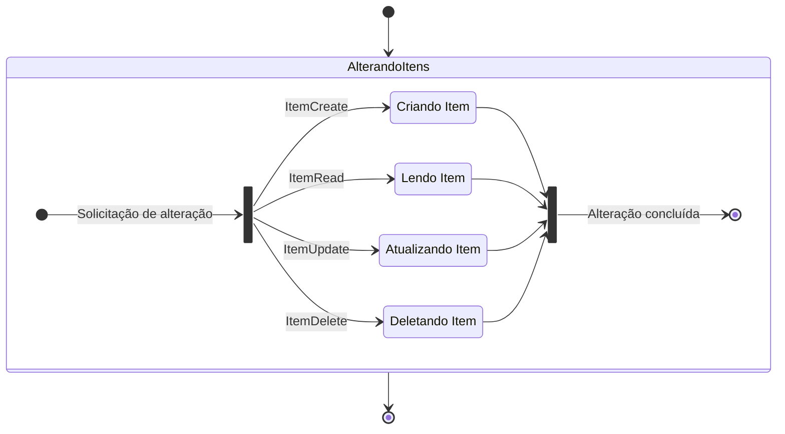
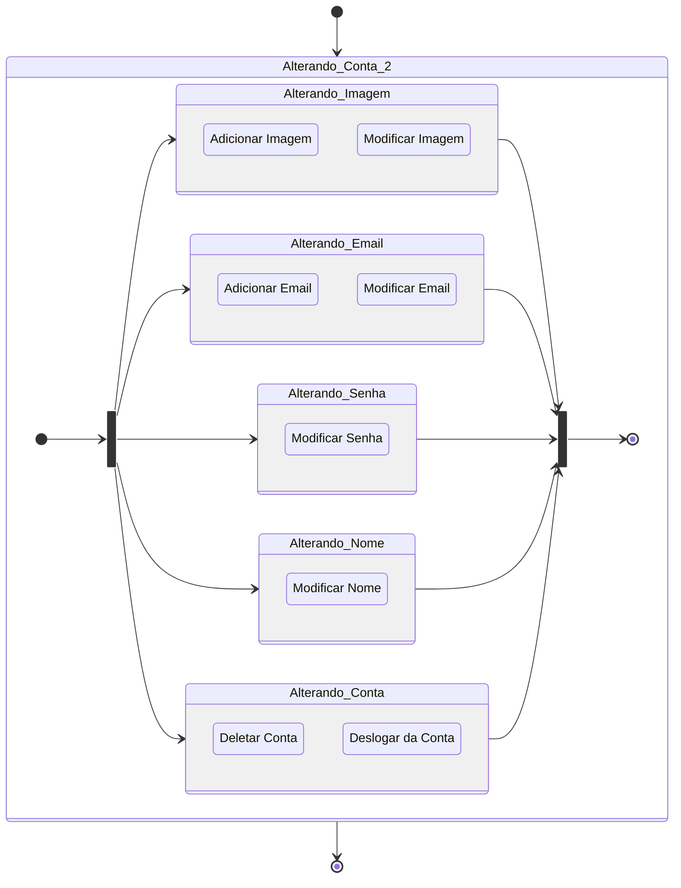

# Diagramas

## UML

### Comportamento

#### **Estados** <!-- (3) -->
<!-- Chat GPT -->
> O diagrama de estados UML (Unified Modeling Language) é um tipo de diagrama que é usado para representar os diferentes estados que um objeto pode assumir durante o seu ciclo de vida e as transições entre esses estados. Ele é usado para modelar o comportamento de um sistema ao longo do tempo e pode ser útil para entender como um objeto reage a eventos externos e internos.
>
> Um diagrama de estados UML consiste em um conjunto de estados e transições. Cada estado representa uma condição ou um comportamento de um objeto, enquanto cada transição representa uma mudança de um estado para outro.
>
> Os estados podem ser divididos em três categorias:
>
> 1. Estados ativos: são os estados em que o objeto está realizando alguma ação. Por exemplo, um objeto pode estar em um estado ativo enquanto estiver processando um pedido ou enviando uma mensagem.
> 2. Estados passivos: são os estados em que o objeto está aguardando algum evento externo ou interno para mudar de estado. Por exemplo, um objeto pode estar em um estado passivo enquanto aguarda uma resposta de outro objeto.
> 3. Estados finais: são os estados em que o objeto não pode mais mudar de estado e o processo é encerrado.
>
> As transições são representadas por setas que ligam os estados. Cada transição tem um nome que descreve o evento que causou a mudança de estado, bem como uma condição que deve ser atendida para que a transição ocorra.

##### Sistema Geral

[Link ao diagrama][ImgUMLComportamentoEstados1]

###### **Imagem do diagrama: UML - Estados - Sistema Geral**

##### Alterando Configurações

[Link ao diagrama][ImgUMLComportamentoEstados2]

###### **Imagem do diagrama: UML - Estados - Alterando Configurações**

##### Alterando Itens

[Link ao diagrama][ImgUMLComportamentoEstados3]

###### **Imagem do diagrama: UML - Estados - Alterando Itens**

##### Alterando Conta

[Link ao diagrama][ImgUMLComportamentoEstados3]

###### **Imagem do diagrama: UML - Estados - Alterando Conta**

## Links

[ImgUMLComportamentoEstados1]: https://github.com/
[ImgUMLComportamentoEstados2]: https://github.com/
[ImgUMLComportamentoEstados3]: https://github.com/

