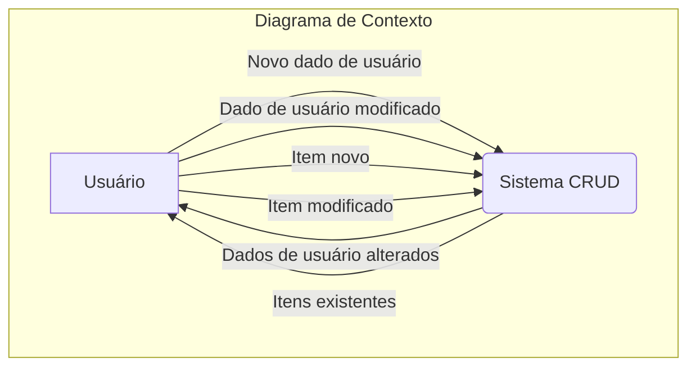
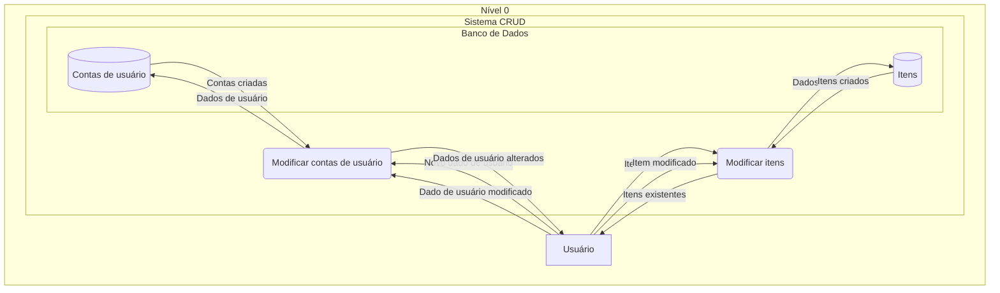
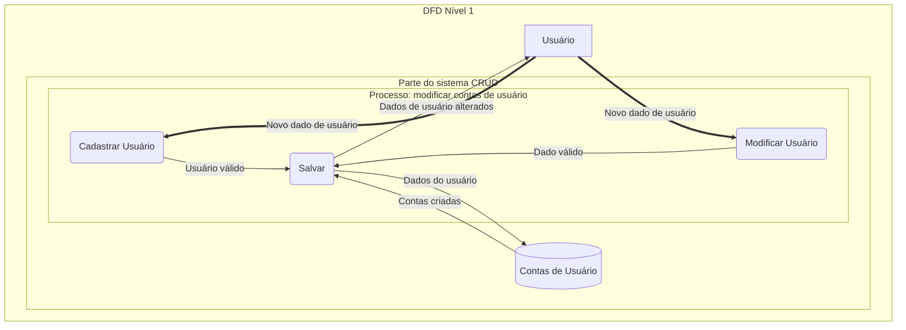
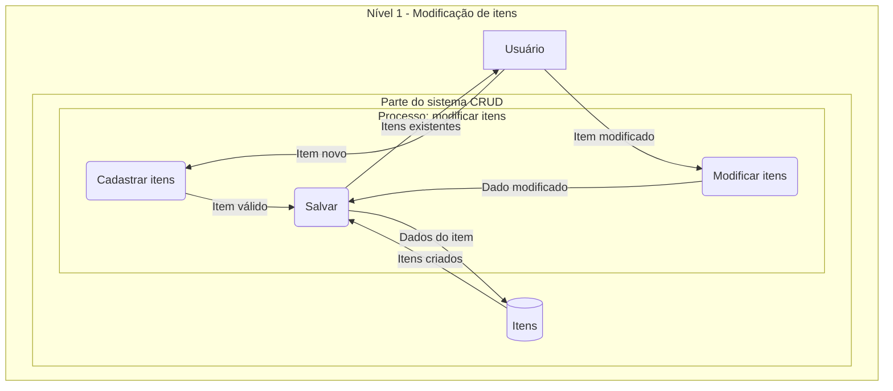
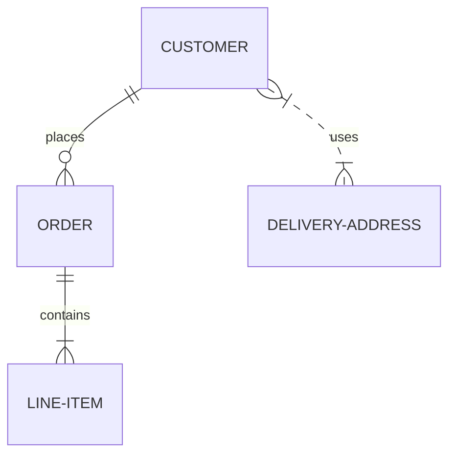
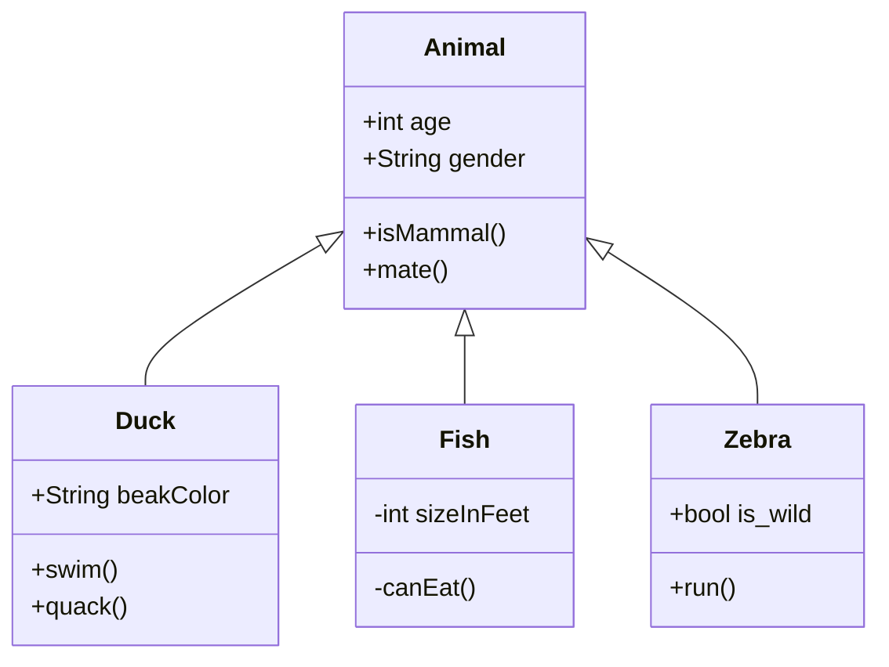
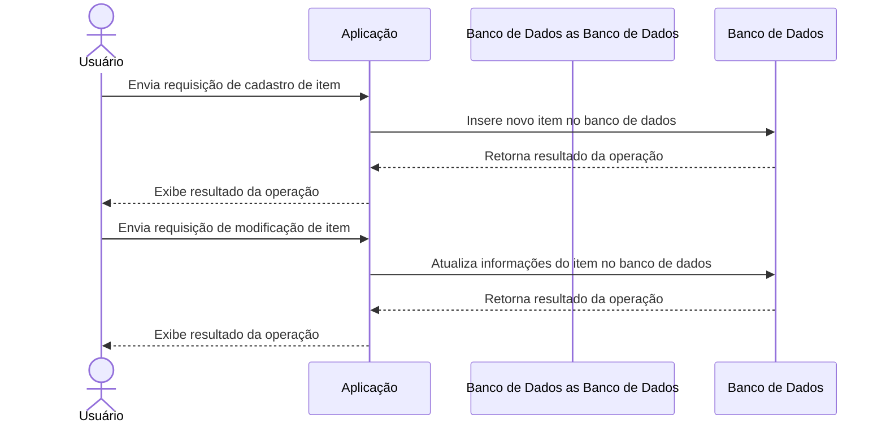
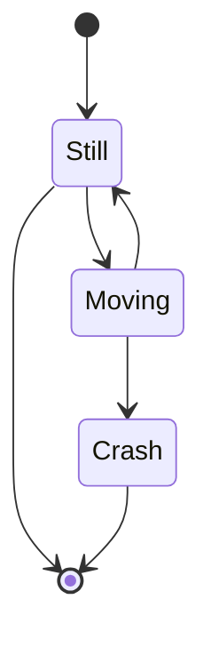
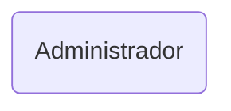

# Diagramas

Como XXX diz, "" \[diagramas são usados para representar visualmente aspectos do sistema\]. Eles podem mostrar diferentes aspectos do que está, ou será, desenvolvido. Pode mostrar, ao usuário como interagir apropriadamente com o sistema e/ou ao desenvolvedor de software como que o sistema deveria funcionar ou deveria ter.

Temos diversos tipos de diagramas que serão descritos abaixo, seguidos de representações do sistema.

## Diagramas de Fluxo de Dados (DFD) (3)

Um deles é o [Diagrama de Fluxo de Dados (DFD)][LinkDFD]:

> Ele utiliza símbolos definidos, como retângulos, círculos e flechas, além de rótulos de textos breves, para mostrar entradas e saídas de dados, pontos de armazenamento e as rotas entre cada destino.

Para representar o sistema utilizando o DFD, há a estratégia Top-Down que consiste em gradualmente especificar cada vez mais a forma como a aplicação lida com suas funcionalidades.

Inicialmente é criado um [Diagrama de Contexto][DiagDFDContexto] que apresenta o sistema como um todo. Em seguida, esse sistema é apresentado em um [DFD de nível 0][DiagDFDNivel0] em que demonstra seus processos. A partir daí, são gerados outros diagramas de maiores níveis que permitem se aprofundar cada vez mais no funcionamento de cada um dos processos.

### DFD - Diagrama de contexto

> É o primeiro DFD de qualquer processo operacional. Mostra o contexto no qual o processo se enquadra.
>
> Elementos:
>
> - Um único processo: o próprio sistema (ou subsistema)
> - As entidades externas: as que interagem com o sistema
> - Os fluxo de dados que chegam e saem das entidades externas
>
> Sistema como um todo

Nesse diagrama são apresentadas as interações que ocorrem entre os agentes externos e o sistema. Sendo elas a troca de informações envolvendo cadastro e modificação dos dados referentes à contas de usuário e itens.

### DFD - Nível 0

> Sistema completo como um conjunto de processos

O sistema nível 0 acaba sendo o segundo diagrama na estratégia Top-Down e apresenta o sistema apresentado no [Diagrama de Contexto][DiagDFDContexto] decomposto em diversos processos que serão mais detalhados nos níveis superiores.

Este diagrama mostra com mais detalhes de que forma os processos internos do sistema interagem entre si e com o usuário. Mostra também suas interações com o banco de dados.

Os dois processos mostrados são referentes a modificação dos dados de usuário e de itens. Ambos recebendo informações do usuário e salvando-as no banco de dados.

### DFD - Nível 1 - Modificar contas de usuário

Neste diagrama é exemplificado o fluxo dos dados durante um cadastro de conta feito pelo usuário. Nele, inicialmente o Usuário informa o seu nome e senha na página de cadastro. A página encaminhará esses dados para a validação que checará se o nome pretendido está disponível. Caso esteja, a conta será criada, armazenada no banco de dados e será informado ao usuário que sua conta foi criada. Caso contrário, o usuário receberá uma mensagem de que o nome já existe e que a conta não foi cadastrada.

A modificação de dados do usuário, exemplificada abaixo pela solicitação de mudança do nome de usuário ou senha, ou qualquer outro dado, passa por um processo similar ao do cadastro.

O usuário informa qual dado quer modificar e qual o novo valor. O sistema verifica a validade desse novo valor. Caso seja válido, é modificado no banco de dados e o sistema informa o sucesso ao usário, caso contrário, apenas informa qual a falha ocorrida na modificação.

### DFD - Nível 1 - Modificar itens

O fluxo de dados para a modificação de itens segue uma rota muito similar a de modificação de dados da conta de usuários. Assim como no diagrama anterior, os mesmos passos genéricos são realizados:

> O usuário informa qual dado quer modificar e qual o novo valor. O sistema verifica a validade desse novo valor. Caso seja válido, é modificado no banco de dados e o sistema informa o sucesso ao usário, caso contrário, apenas informa qual a falha ocorrida na modificação.

## [Diagramas de Entidade e Relacionamento (ER) (1)][LinkMermaidER]

Outro é o Diagrama de Entidade e Relacionamento...

## UML Diagrams

### Structure Diagrams

#### [Class (1)][LinkMermaidClass]

### Behavioral Diagrams

#### Use Case (5)

Use Case Diagrams

#### [Sequence (3)][LinkMermaidSequence]

##### Cadastro e modificação de itens

Esse diagrama mostra o fluxo de dados para o cadastro e modificação de itens em um banco de dados. O usuário envia uma requisição de cadastro ou modificação de item para a aplicação, que, por sua vez, envia a requisição para o banco de dados. O banco de dados processa a requisição e retorna o resultado da operação para a aplicação, que por fim exibe o resultado para o usuário.

<!-- CHAT GPT -->

##### WIP

#### Activity (3)

Activity Diagrams

#### [State Machine (3)][LinkMermaidState]

State Machine Diagrams

## To Do

- [ ] Corrigir a linguagem utilizada para uma mais formal
- [ ] DFD
  - [ ] Checar se os diagramas e textos ainda estão de acordo com o sistema.
  - [ ] Usar a [Aula sobre DFD][AulaSobreDFD] para aprimorar meus diagramas
    - [ ] Aplicar a [Regra de Miller][AulaSobreDFD] na quantidade de processos por DFD
- [ ] Adicionar referências
- [ ] Adicionar as imagens
- [ ] Tornar a maioria dos elementos clicáveis
  - [ ] Os elementos que forem clicáveis, devem ter uma cor diferente

## Links

[LinkDFD][LinkDFD]: O que é um diagrama de fluxo de dados?
[LinkMermaidSequence][LinkMermaidSequence]: Mermaid Sequence
[LinkMermaidClass][LinkMermaidClass]: Mermaid Class
[LinkMermaidState][LinkMermaidState]: Mermaid State

[LinkDFD]: https://www.lucidchart.com/pages/pt/o-que-e-um-diagrama-de-fluxo-de-dados

[LinkMermaidSequence]: https://mermaid-js.github.io/mermaid/syntax/sequenceDiagram.html
[LinkMermaidClass]: https://mermaid-js.github.io/mermaid/syntax/classDiagram.html
[LinkMermaidState]: https://mermaid-js.github.io/mermaid/syntax/stateDiagram.html
[LinkMermaidER]: https://mermaid-js.github.io/mermaid/syntax/entityRelationshipDiagram.html
[AulaSobreDFD]: https://docplayer.com.br/35646273-Dfd-diagrama-de-fluxo-de-dados-explosao-das-bolhas-do-dfd-de-nivel-0-aula-08.html
<!-- Atualizar para ser o hyperlink para o título correto -->
[DiagDFDContexto]: https://github.com
[DiagDFDNivel0]: https://github.com
<!-- Atualizar para ser o hyperlink para o título correto -->
